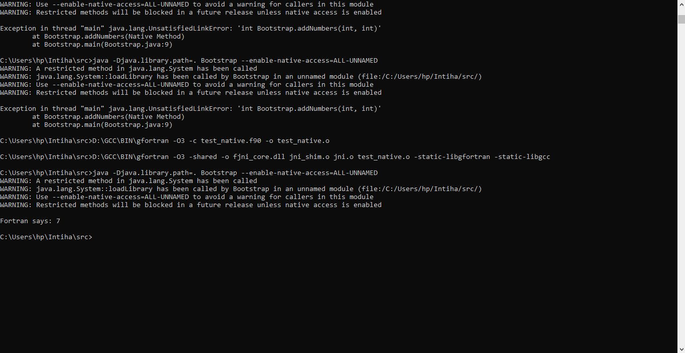

# fjni
cool brrrrrrrrr speed port of jni to fortran 
## build steps
go figure this out urself bih
jk i aint that evil
* gcc -O3 -c jni_shim.c -I"%JAVA_HOME%\include" -I"%JAVA_HOME%\include\win32" -o jni_shim.o
* gfortran -O3 -c jni.f90 -o jni.o
* gfortran -shared -o fjni_core.dll jni_shim.o jni.o -static-libgfortran -static-libgcc
(NOTE IF YOU DONT HAVE JNI.H, USE THE JNI.H IN THIS REPO'S JNI.H)
## PROOF OF IT WORKING:

